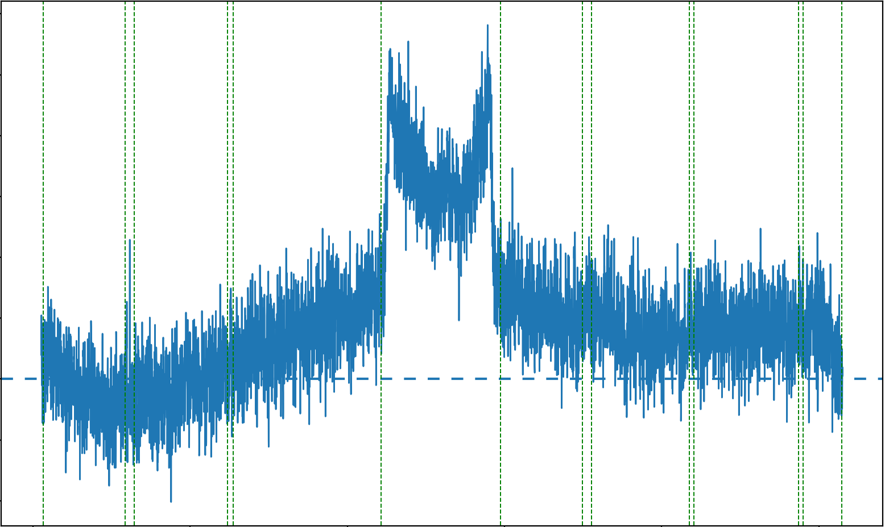
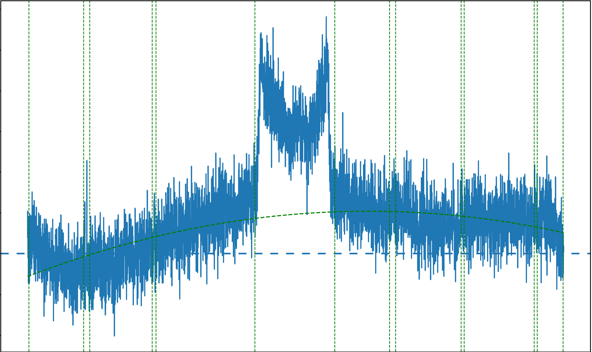
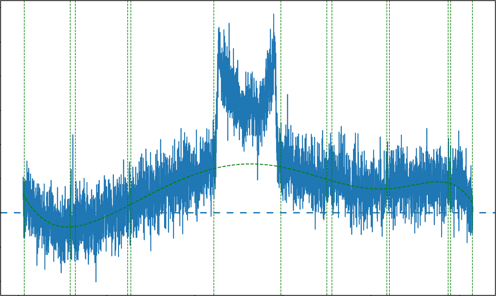
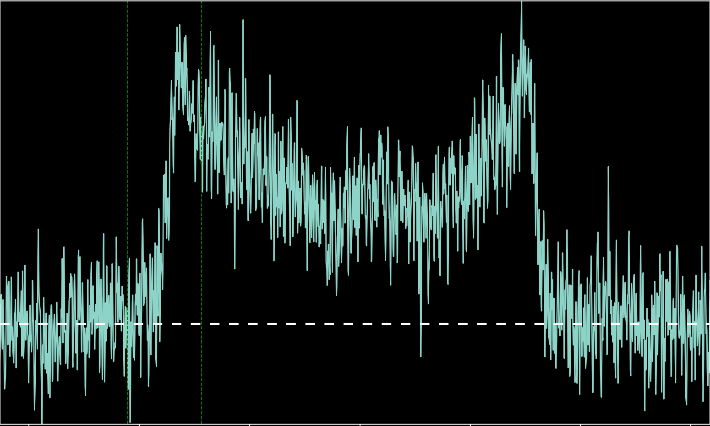
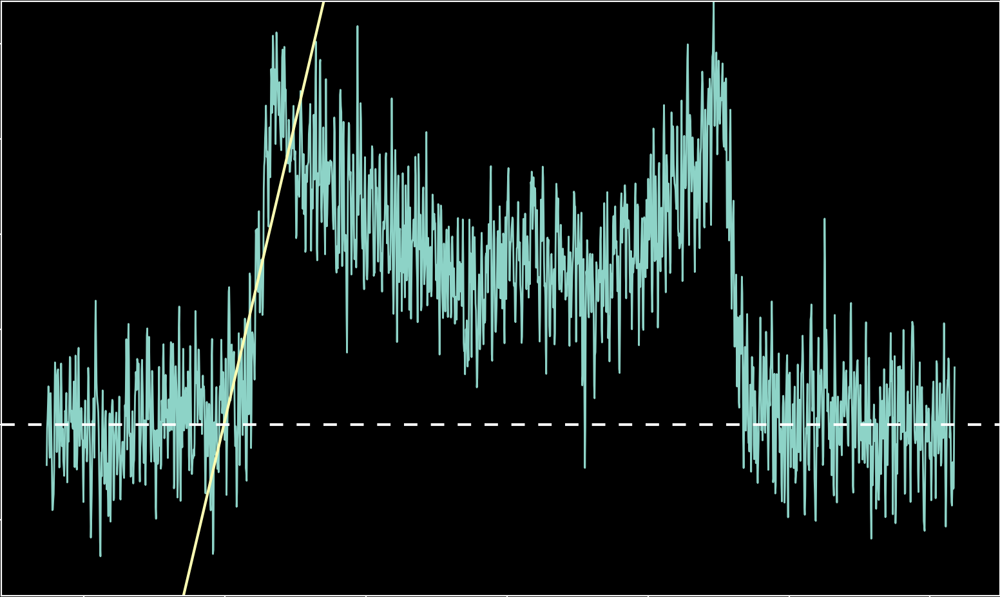
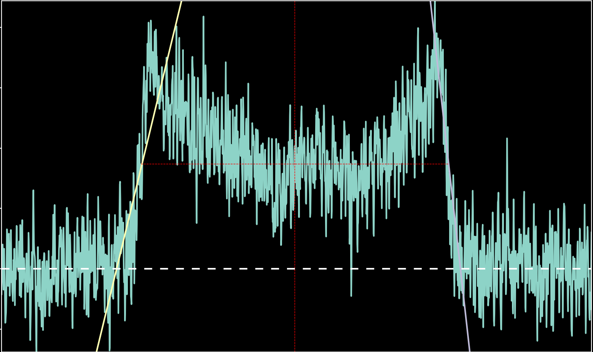
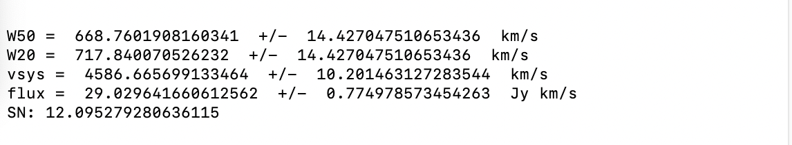

# Introduction

Welcome to pyAPPSS, a set of python-based data reduction scripts for APPSS, the [Arecibo Pisces-Perseus-Supercluster Survey.](https://iopscience.iop.org/article/10.3847/1538-3881/aaf890) pyAPPSS takes data from radio telescopes, primarily in the 21cm HI emmission line, in the form of a spectrum, and reduces it into a form then usuable for science, with values such as object velocity and total object flux (in Jy*km/s). It offers a few options for how the reduction should be conducted, including 3 options for the fit - a gaussian curve, a two-peak fit, and a trapezoidal fit.

# Setup
#### Python

These scripts use several python libraries. The instructions and suggestions for properly setting up a python environment are found [here.](pyappss/pyappss_env_readme.md) This list should be comprehensive, but if a script returns an error due to a missing library, it can be imported following the general guidelines of the instructions.

#### File Management

Currently, the various scripts needed to run the main script, reduce.py, are separated into various folders. To allow reduce.py to run, the following changes need to be made: create a new folder wherever you like, and move the following files into it: convert.py, reduce.py, smooth.py, baseline.py, and measure.py. Next, open up baseline.py, and at the top where it says "from analysis import smooth," remove "from analysis" so the line only reads "import smooth." Save the file, and do the same thing for baseline.py. In reduce.py, find where it says to "from analysis import baseline" and "from analysis import measure," and similarly remove the "from analysis" portion of the line. Save the file, and now the scripts should be able to run. 
Additionally, if file conversion is necessary, then move "convert.py" into this folder as well.
# Running the Code
#### File Conversion
If your .fits files that need to be reduced are not in the APPSS format, specifically if the data was obtained using the Green Bank Telescope, then convert.py is needed. Create a new directory named "raw" in the folder with all of the scripts, and move all the fits files that need conversion into that folder. Make sure that these files are named xxxxxx.fits, where the x's are the AGC number of the galaxy. Run convert.py in whatever python environment is being used, and the converted files will be in a new directory titled "processed." These files can then be moved up one directory, to the directory with reduce.py and other needed scripts.
###### Additional Options
When executing convert.py, it allows an additional argument, calling a flag related to specific projects. This flag allows the output file headers to be populated with known values for specific observation programs, that are not found in the headers or data of the original files.
To use this function, add `-flag` when you are running convert.py, followed by the relevant flag for the project. Example: `python3 convert.py -flag AGBT22A-430`. If an unsupported flag is input, then the code will quit and say so.
The currently supported project flags are: `AGBT22A-430`.
#### Basic Reduction
Optimally, the input spectra should be a classic, double-horned galaxy profile, so the basic procedure makes this assumption. Similarly to convert.py, the main script offers a set of configuration options, some of which are necessary, in this case. To run a very basic setup of reduce.py, two additional arguments are required - the fit type, and the galaxy number. The former has three primary options, but typically should be `twopeak`. The latter is merely the AGC number of the galaxy - for example, `26163`. So, an example code could be executed as `python3 reduce.py -twopeak 26163`, which will apply the reduction procedure to a file named 'AGC26163.fits'. This file does need to be in the same directory as reduce.py, so may need to be moved from the "processed" directory. 
One the code has been executed, the scripts begin to run. First, a smoothing function will be applied to the data. This function can be configured. Next, the spectrum must be baselined. The script will open a python figure window, with the spectrum of the galaxy. The regions with no RFI nor any of the galaxy's signal must be selected in order for a suitable baseline to be fit to the data. Select these regions by selecting bounds using the mouse - click on either end of the chosen region, and two green, dashed lines should pop up. Continue doing so for every RFI/signal free region. 
 
Often, applying several regions within these clean regions allows the code to attach a more suitable solution.  When done, return to where the code was run, and hit Enter. The script will now attach a polynomial fit to the selected regions. Once the script has chosen an appropriate function, it should overlay as a dashed, curved line, and output the order of this polynomial. 
 
If the baseline fit does not appear suitable, before hitting Enter type a number from 0-9, and then hit Enter, and the code will display the chosen polynomial of that order. All of the orders can be explored, and the code does not always choose the best order - for this example galaxy, the 7th-order fit produces far better results. 
 
Once a polynomial of appropriate order is set and plotted, hit Enter to apply the baseline. The figure should change, and  all the data except for the signal should be zeroed or near zero. The script will now ask you to confirm this baselining - hit Enter once more to move on. But, if the spectrum is not properly zeroed, merely type anything else and hit Enter - you can now retry with different order fits once more. 
 
Once the baseline has been chosen and applied, hit Enter and a new figure will be brought up. Now the code will ask if you wish to keep the fit model you selected at the start - if you do, type `yes` and hit Enter. Typing anything else and pressing Enter will allow selection of different, or even multiple models at once. To finish choosing fit models, hit Enter once more.
The code will say to select the regions with the signal - click some distance away from the galaxy's signal, on either side, and hit Enter. Next, you will be told to select the region around the left emission. Similarly to the previous regions, click once on either side of the region to choose. In this instance, the left emission means the leftmost peak of the galaxy's signal, and its fading away to the noise. 
 
Do attempt to keep the region very close to the bounds of this leftmost emission, which allows a more precise fit. Once the region has been selected, hit Enter. The code will then attach a linear fit to the leftmost peak, and ask if the fit is suitable. 
 
If it is, hit Enter. Otherwise, type anything else and hit Enter. Do the same procedure for the right emission/peak. 
Once this has been done, the code will calculate the important values of the galaxy, and should project an overlay over the figure, 
 
and display the information. 
 
Type any desired comments to be attached to the data, and hit enter to save the results. These results will be saved to a file named "ReducedData.csv". As long as no version of this file existed previously in the directory, it should write a new file with the columns properly labeled for ease of loading into Excel or other spreadsheet programs.
#### Additional Options
###### Alternative Smoothing Methods
When running reduce.py, an additional pair of arguments can be added `-smo` followed by an integer. This applies a boxcar smoothing, sized by that integer, to the data, before baselining. For example, `-smo 7` applies a boxcar smooth of 7 to the data. Example: `python3 reduce.py -smo 7 -twopeak 26163`
###### Alternative Fits
There are two alternative options to fit the galaxy signal and calculate values such as HI flux of the galaxy. These options are `-gauss` and `-trap`. These options would replace the `twopeak` argument when running reduce.py. Alternatively, they can be added to the initial call - multiple methods can now be run at once, one after another: `-twopeak -gauss -trap` is valid! To track the fit methods, the .csv output file has a column that indicates method used - this allows multiple methods to be easily tried for the same galaxy, potentially yielding very different results (hopefully not!). 
`-gauss`, predictably, fits a gaussian to the signal. When using this option, the difference emerges immediately after baselining. When selecting the region with the signal, be very broad with the bounds of this region - the wider the region, the more accurate the gaussian fit appears to be. Once this is done, a gaussian is immediately calculated for the selected region. Due to issues with the difficulty of obtaining a proper rotational velocity of the galaxy, when using a gaussian fit, this fit option is undesirable, although some spectra are only suitable for this method. Unfortunately, it works best on galaxies with a high signal-to-noise ratio, which typically are the most prominent, double horned galaxies - lower S/N means a far worse fit. 
`-trap` fits a trapezoid to the galaxy signal. This option is best used when the galaxy's signal is clear and distinct from the noise, but has a flatter profile, and may not have pronounced horns. The difference in this method arises after selecting the region with the signal - instead of then choosing an area around the left emission, you will be asked to select 4 points around the data. Attempt to match these points to the lower and upper left corners of the signal, and the lower and upper right corners of the signal as well. Once this has been done, a trapezoid which fits the selected points will be calculated.
###### "Publication" Light Mode
The data can be entirely plotted in a light mode, which is  more suitable for publication. In order to do so, add the `-pub` argument. Example: `python3 reduce.py -pub -twopeak 26163`.
###### No Confirmations Mode
When running the initial reduce.py, if you do not want the confirmations for baseline selection (after zeroing), or for choosing fit methods, merely add the `-noconfirm` argument. This will remove both of these confirmation methods, allowing slightly speedier reduction if the user is trusting in their initial choices. Example: `python3 reduce.py -twopeak -noconfirm 26163`.
# 